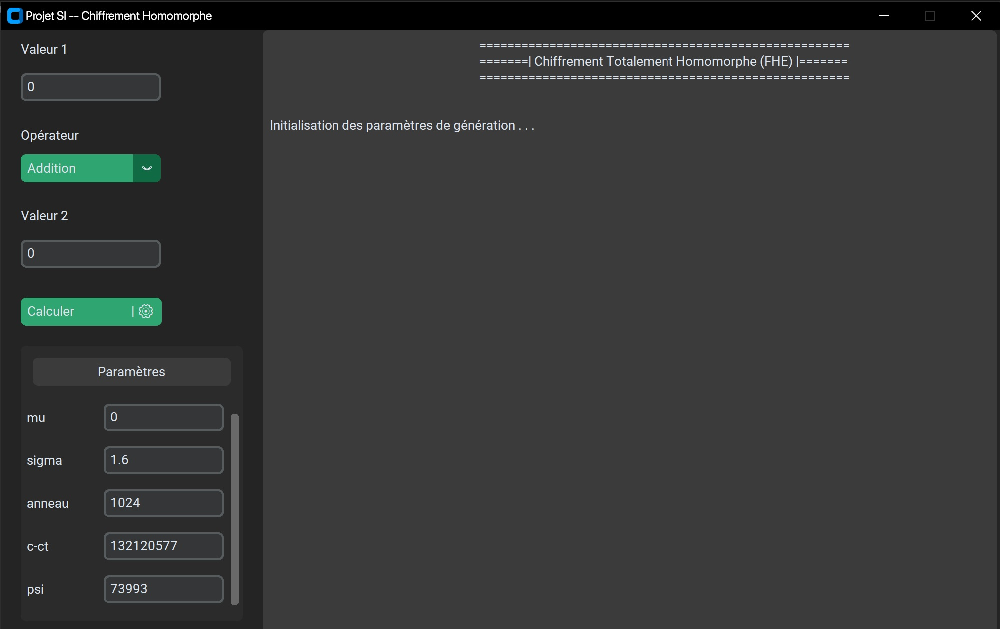
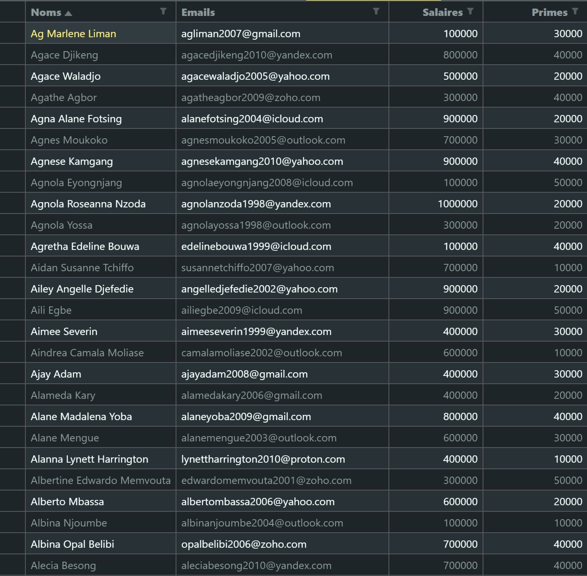
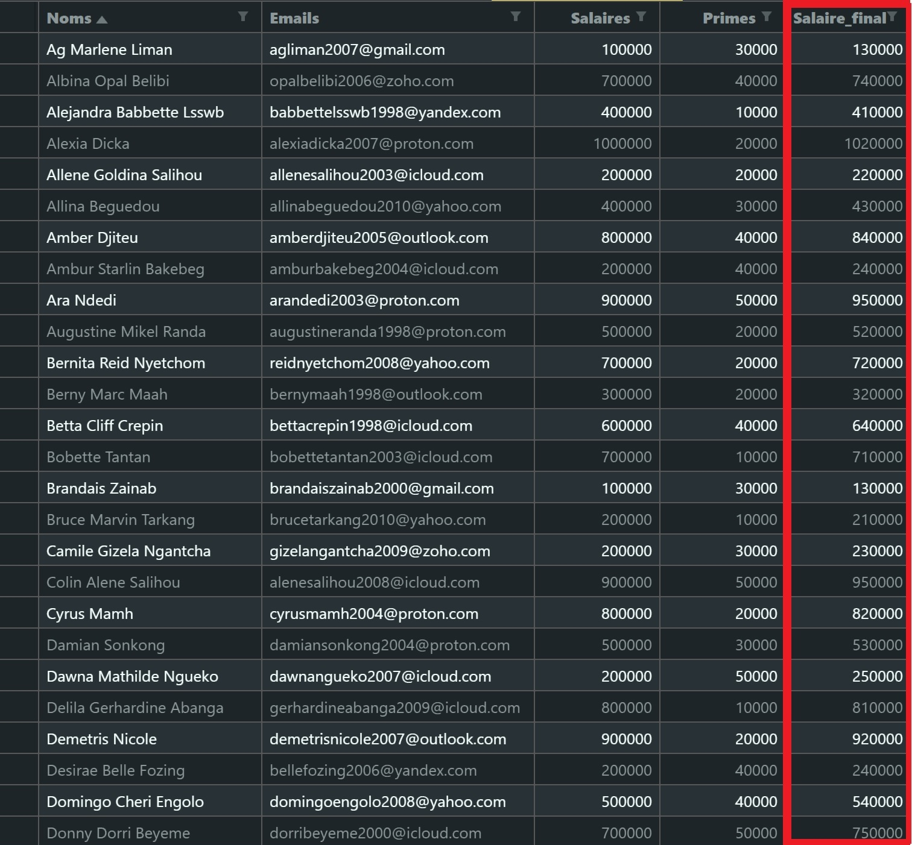

<h2 align="center">FHE-BFV</h2>
<h4></h4>

<div align="center">

[]()
[](https://github.com/IgorGreenIGM/FHE-BFV/issues)
[](https://github.com/IgorGreenIGM/FHE-BFV/issues/pulls)
[](/LICENSE)

</div>

---

<p align="center"> Chiffrement Homomorphe : Implémentation du <b>schéma BFV<b/>
    <br> 
</p>

## 📝 Table des matières

- [À propos](#about)
- [Installation](#getting_started)
- [Utilisation](#usage)
- [Auteurs](#authors)

## 🧐 À propos <a name = "about"></a>

L'objectif de ce projet est de présenter une implémentation d'un schéma de chiffrement homomorphe, en particulier le schéma BFV. Il s'agira ici de présenter plusieurs implémentations, en vue de démontrer dans des cas pratiques la nécessité de tels algorithmes.

03 implémentations seront présentées ici : <br>
✔ Interface graphique<br>
✔ Implémentation Réseau<br>
✔ Calculs aléatoires<br>

## 🏁 Installation <a name = "getting_started"></a>

>⚠️ Vous devez avoir git installé<br>
>⚠️ minimal python version : Python 3.10<br>

Téléchargement du code en local : 
```console
git clone https://github.com/IgorGreenIGM/FHE-BFV
```

Installation des modules python nécéssaires : 

```console
pip install numpy
pip install pandas
pip install matplotlib
pip install customtkinter
```

## 🎈 Utilisation <a name="usage"></a>

<h4><u> Interface graphique : </u></h4>
Se placer dans le dossier <b><i>ui</i></b> du projet et taper la commande : <br>

```console
pyton ui.py
```
<br>


<h4><u> Calculs aléatoires : </u></h4>
Il s'agit ici de générer une serie d'operandes aléatoires et d'operateurs, de chiffrer les opérandes et d'éffectuer les calculs sur les operandes en fonction des opérateurs(+, x, -).

Se placer dans le dossier <b><i>example</i></b> du projet et taper la commande : <br>

```console
pyton benchmark.py
```

<h4><u> Implémentation réseau : </u></h4>


Ici, nous simulons un cas de figure réel dans lequel une entreprise A a besoin d'effectuer un calcul certaines opérations(augmentations des primes) sur les salaires de ses employés, mais de dispose pas de la puissance de calcul nécéssaire.


Elle décide alors de se tourner vers un <i>datacenter</i> pour la réalisation de ses calculs. mais néanmoins elle ne souhaite pas que le datacenter ait access à ses données en clair. D'ou l'utilisation du schéma BFV.

Il est nécéssaire d'avoir deux ordinateurs en réseau et de connaitre l'adresse IP d chacun d'entre eux, l'un fonctionnant en tant que client(entreprise A) et l'autre en tant que server(Datacenter).

> le fichier des employés de A se trouve dans le repertoire : "network/datas/datas.csv"


<u>Demarrage du serveur :</u><br> 
ouvrir le fichier <i>network/server_send.py</i> (sur le pc serveur) et modifier la variable "CLIENT_IP_ADRESS" par l'adresse IP du client.

Se placer dans le dossier <b><i>network</i></b> du projet et taper la commande :<br>
```console
pyton server_receive.py
```

<u>Demarrage du client :</u><br> 
ouvrir le fichier <i>network/client_encrypt.py</i> (sur le pc client) et modifier la variable "SERVER_IP_ADRESS" par l'adresse IP du serveur.

Se placer dans le dossier <b><i>network</i></b> du projet et taper la commande :<br>
```console
pyton client_encrypt.py
```

Le fichier sera alors chiffré et transmis au server par le client.
Une fois le travail de calcul par le serveur terminé : 

Sur le pc client tapez la commande :
```console
pyton client_decrypt.py
```

Sur le pc server tapez la commande :
```console
pyton server_send.py
```

Le fichier calculé sera alors reçu par le client, qui le dechiffrera et le fichier final sera dans le repertoire "network/datas/results/final.csv"


## ✍️ Authors <a name = "authors"></a>

- [@IgorGreenIGM](https://github.com/IgorGreenIGM) - Idea & Initial work
- [@TchassiDaniel](https://github.com/TchassiDaniel)